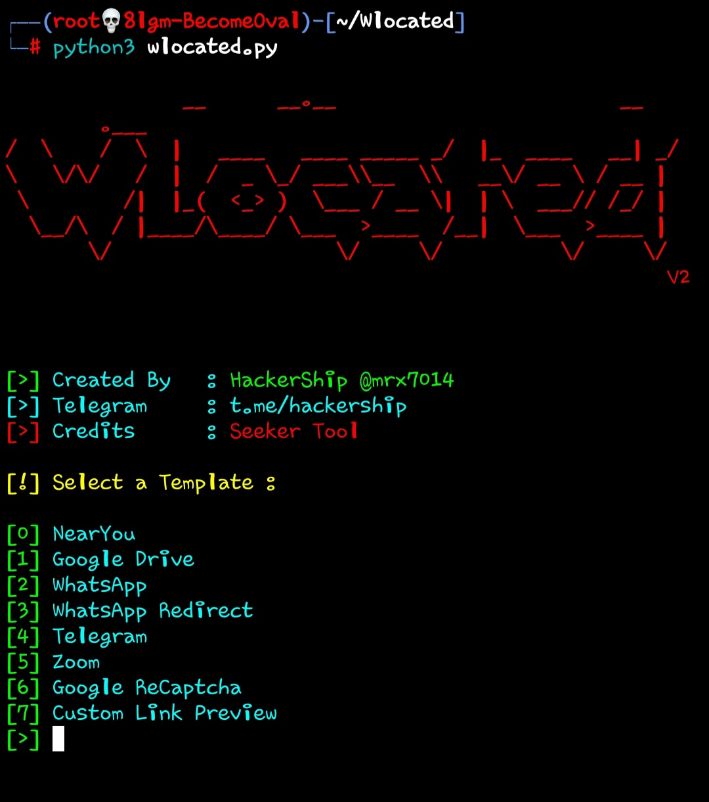
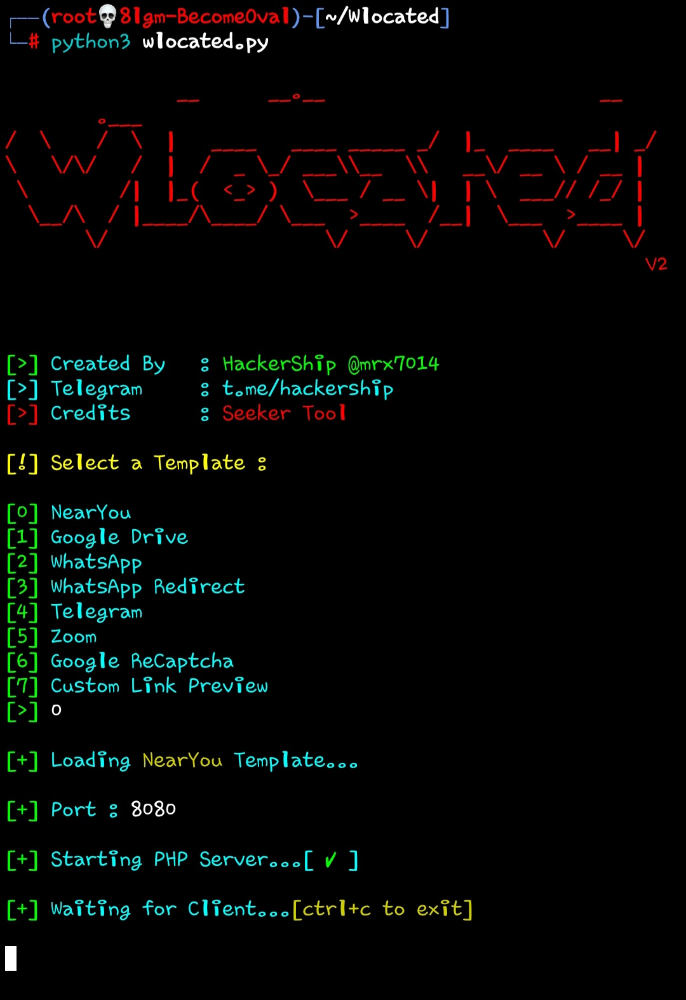
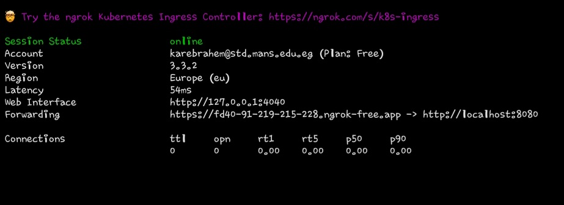
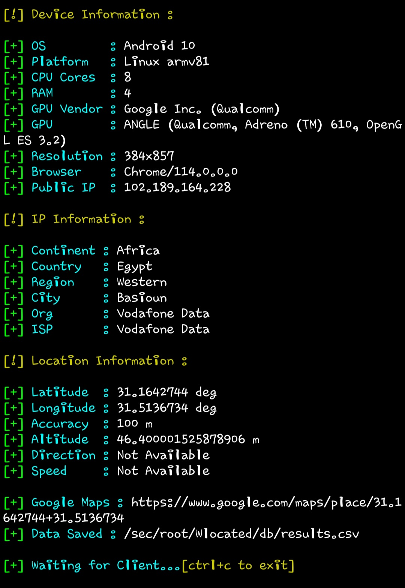

<div align="center">
  
    </div>
<div align="center">
  
**An open source prjkt allowed you to locate any person through a link only**
<br>

# V2.0.0 has been released!
</div>
<br>
<div align="center">
  
**Developed and brought to you by Team Hacker Ship**
</div>

<div align="center">
  
<a href="https://www.buymeacoffee.com/mrx7014"></a>
</div>
<br>

<div align="center">

**Let's know how to use this**
</div>

<br>

# 🛠 Requirements:

- Any linux system or termux.

> We recommended to use this free server to test this tool,Check this server form <a href="https://www.github.com/mrx7014/SSH-KaliLinux">SSH Kali Linux</a>
>

<br>

# ⚙️ Installation

- First clone repository
```sh
sudo apt install git ; git clone https://www.github.com/mrx7014/Wlocated
```
- After clone repo install tool requirements

```sh
cd Wlocated ; ./install.sh
```
<br>

<div align="center">
  
**Now tool is installed,let's do anoter requirements**
</div>

<br>

- Now create an account on <a href="https://ngrok.com/">Ngrok</a>
- After this download ngrok, choose your system architecture `ARM` or `ARM64` or `32-bit` and download it from this commands.

> This commands will download and install ngrok automatically
>

**ARM64**
```sh
wget https://bin.equinox.io/c/bNyj1mQVY4c/ngrok-v3-stable-linux-arm64.tgz ; tar -xvf *.tgz
```
**ARM**
```sh
wget https://bin.equinox.io/c/bNyj1mQVY4c/ngrok-v3-stable-linux-arm.tgz ; tar -xvf *.tgz
```
**32-bit**
```sh
wget https://bin.equinox.io/c/bNyj1mQVY4c/ngrok-v3-stable-linux-386.tgz ; tar -xvf *.tgz
```
- After this go back to ngrok and go to authtoken session and you will find commamd like this

```diff
ngrok config add-authtoken 2TfmXXXXXXXXXXXXXXXXXXXXXXXX
```
> Don't copy this command it's just a example
>

- **Now authtoken added,let's know how to use tool after install ngrok.**
<br>

- Go back to tool directory by `cd Wlocated` then type:
```sh
python3 wlocated.py
```

- After this tool will open.
<div align="center">

</div>
<br>

- Now choose any templete you want.
`Near You`
`Whatsapp`
`Whatsapp Redirect`
`Telegram`
`Zoom`
`Google ReCaptcha`
`Custom Link Preview`
<br>

- For example we choose nearyou templete,After this PHP server will starting on port `8080`
<br>

<div align="center">

</div>
<br>

- Now open another terminal and type:

```sh
./ngrok http 8080
```
- To open port for website
<br>

<div align="center">

</div>
<br>

- Now you will see that,now copy `https` link and open ir on browser

- After that press on containue and website will ask you give him location permission.

- After give website permission go back too Wlocated tool to see informations
<br>

<div align="center">

</div>

- Now you have all inforamtions about victim like: `Device Information` , `Real Location` , `Browser Information` and many other things.
<br>

- Now copy **Google Maps** link that contain **latitude** & **longitude**.
<br>
<br>

# Let's Create Some Magic 🪄

- You can Mask **Ngrok Link** In order to hide the ngrok link Like This:

`https://people.near.you-people.near.you@da.gd/mX2HNv`
<br>

<div align="center">

</div>
<br>

- Use this <a href="https://github.com/mrx7014/hidephish">Repo</a> to mask links.
<br>

# Contact US:

- Telegram: <a href="https://t.me/hackership">HackerShip</a>
